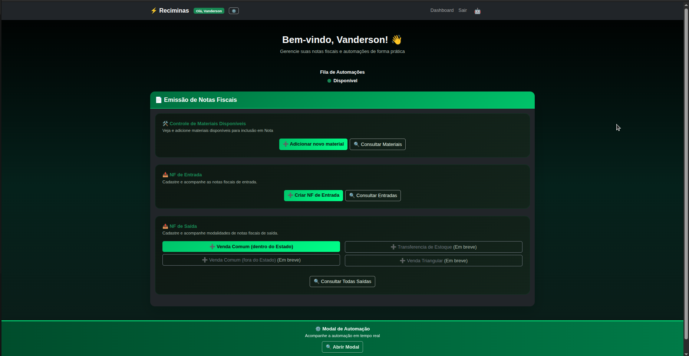

# Reciminas Automation



## Overview

**Reciminas Automation** é uma plataforma que centraliza e automatiza processos operacionais da Reciminas, com foco na emissão e gestão de Notas Fiscais.
A solução combina **Python**, **Django** e bibliotecas modernas de automação para lidar com tarefas que vão desde extração de dados até integração com serviços externos.

A arquitetura modular permite manter, estender e adaptar automações com facilidade, tornando o sistema mais resiliente e escalável.

---

## Features

- 🚀 Automação completa de emissão e gestão de NF-e
- 📊 Extração e processamento inteligente de dados
- 🔗 Integração com APIs, serviços externos e rotinas internas
- ⚙️ Workflows configuráveis para diferentes tipos de automação
- 📝 Sistema robusto de logging e tratamento de erros
- 🖥️ Painel web para monitoramento, administração e acompanhamento de automações em tempo real

---

## Installation

1. **Clone o repositório:**
   ```bash
   git clone https://github.com/yourusername/reciminas-automation.git
   cd reciminas-automation
   ```

2. **Crie e ative um ambiente virtual (recomendado):**
   ```bash
   python3 -m venv venv
   source venv/bin/activate
   ```

3. **Instale as dependências:**
   ```bash
   pip install -r requirements.txt
   ```

---

## Usage (Development Environment)

1. **Configure as variáveis de ambiente:**
   - Copie `.env.example` para `.env` e ajuste conforme necessário.
   ```bash
   cp .env.example .env
   ```

2. **Acesse o diretório do servidor:**
   ```bash
   cd server
   ```

3. **Inicie o servidor:**
   ```bash
   python manage.py runserver
   ```

- O painel web estará disponível em: [http://127.0.0.1:8000/](http://127.0.0.1:8000/)

---

## Project Structure

```
reciminas-automation/
├── server/               # Aplicação Django (backend, painel, APIs)
├── automations/          # Scripts e módulos de automação
├── tests/                # Testes unitários e de integração
├── requirements.txt      # Dependências Python
├── .env.example          # Variáveis de ambiente de exemplo
├── README.md             # Documentação principal
└── main.py               # Ponto de entrada para execuções externas
```

---

## License

Este projeto está licenciado sob a **MIT License**.

---

## Support

Para dúvidas, sugestões ou problemas, abra uma issue
